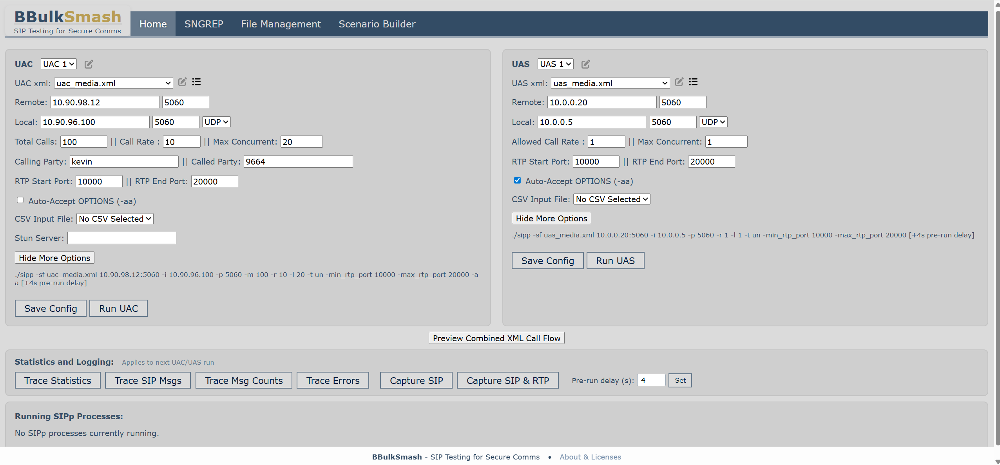
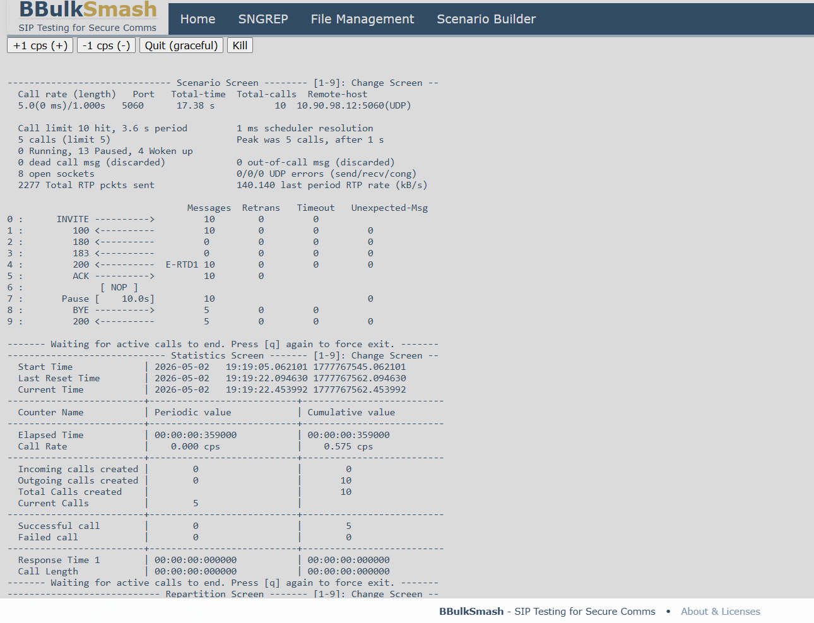
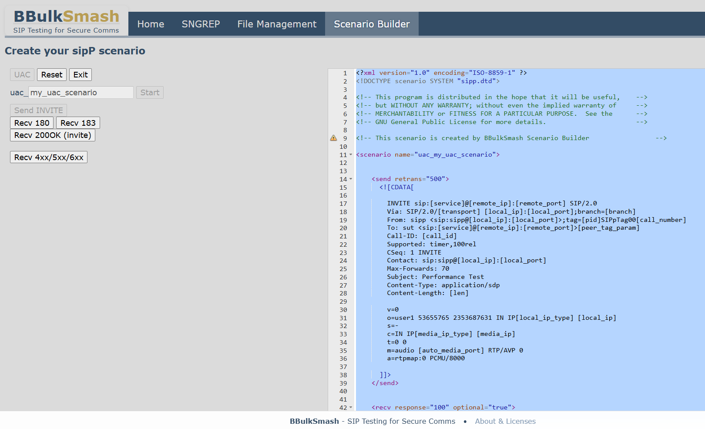
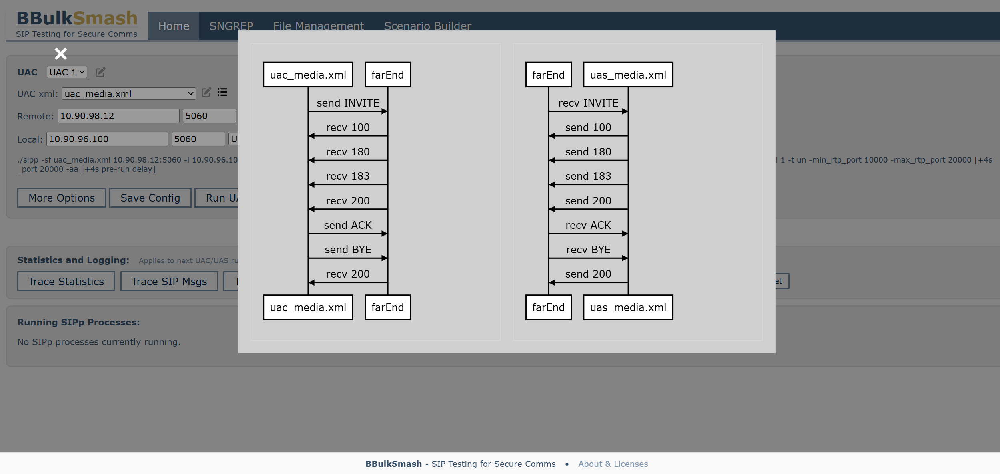
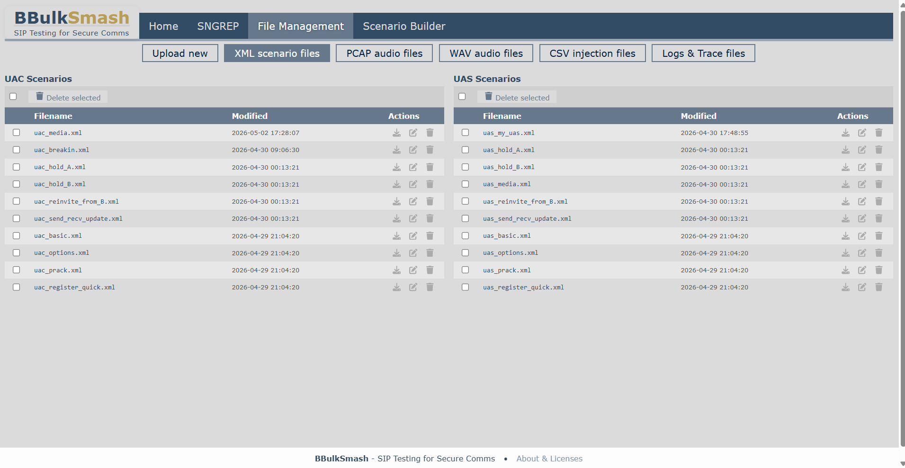
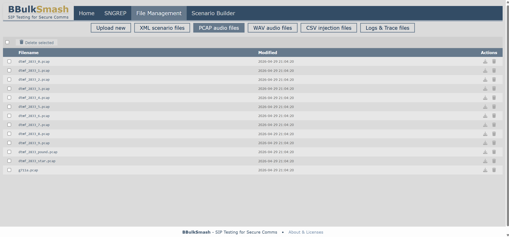
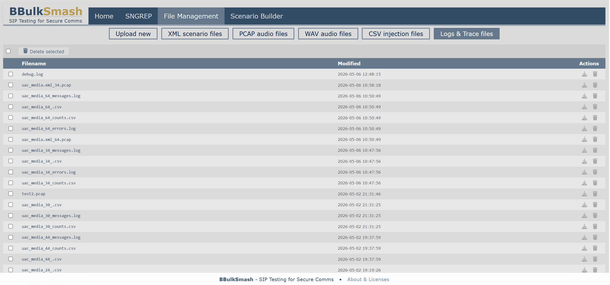
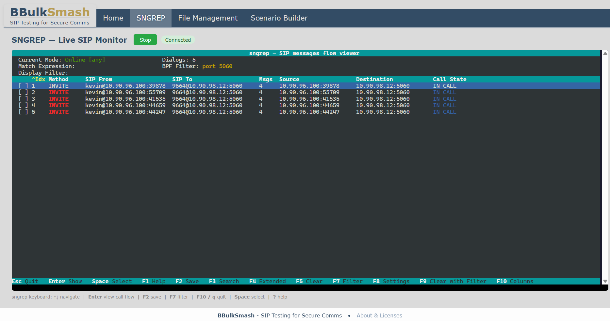
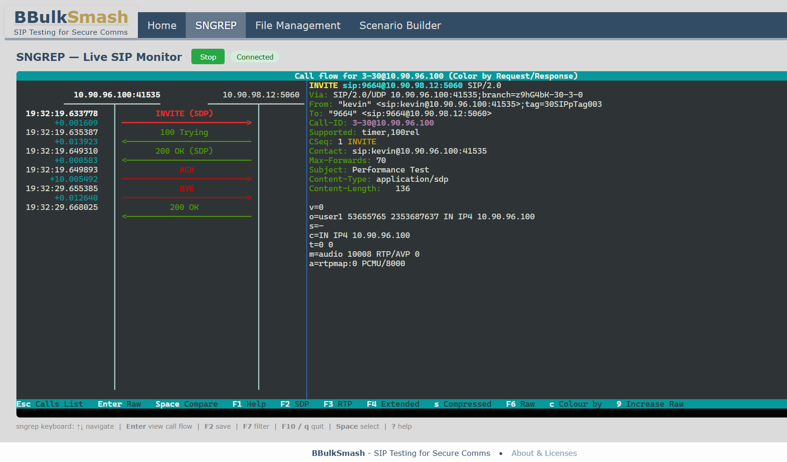

# BBulkSmash — SIP Testing for Secure Comms

**BBulkSmash** is a web-based platform for SIP/VoIP testing. It wraps [SIPp](https://github.com/SIPp/sipp) in a modern interface that lets you create XML scenarios, visualize call flows, launch and monitor tests in real time, and manage all your test files from one place.



---

## Features

- **Scenario Builder** — click-to-build UAC and UAS SIPp XML scenarios without writing XML by hand
- **Call Flow Visualization** — preview sequence diagrams for any XML scenario before running it
- **One-click test execution** — configure and launch UAC/UAS SIPp instances directly from the web UI
- **Real-time monitoring** — live WebSocket-based view of running SIPp screen output with in-browser controls (pause, adjust CPS, graceful quit, kill)
- **Multiple saved configurations** — store and switch between named UAC and UAS configs
- **Command preview** — see the exact SIPp command that will be run before clicking Run
- **Statistics and Logging** — toggle SIPp trace flags (`-trace_stat`, `-trace_msg`, `-trace_counts`, `-trace_err`) and set a pre-run delay to allow time to start monitoring tools before calls begin. Toggle **Capture SIP** or **Capture SIP & RTP** to auto-start a tcpdump capture alongside each SIPp process — pcap files are saved to the logs directory and stop automatically when SIPp exits.
- **File management** — sortable, multi-select file tables for XML scenarios, PCAP audio files, CSV injection files, WAV files, and logs. Bulk delete with confirmation. Tab state persisted across page loads.
- **Log and trace file access** — download and delete SIPp trace files (`.csv`, `.log`, `.pcap`) from the Logs & Trace files tab
- **XML editor** — in-browser Ace editor with XML syntax validation for editing scenarios
- **NAT traversal** — optional STUN server support for behind-NAT deployments
- **Calling/called party substitution** — override SIP From/To/RURI numbers at run time without editing XML
- **Live SIP monitoring** — SNGREP runs inside the container with a full interactive ncurses TUI streamed to the browser via xterm.js and WebSockets. BPF-filtered to configured SIP ports for focused live monitoring.
- **Packet capture** — tcpdump-based capture runs alongside SIPp processes when enabled. "Capture SIP" records SIP signalling only; "Capture SIP & RTP" adds the configured RTP port range. STUN traffic is included automatically when a STUN server is configured. One pcap per SIPp process, named `<xml>_<pid>.pcap`.
- **Auto-Accept OPTIONS** — per-config checkbox adds `-aa` flag to SIPp, automatically responding to OPTIONS keepalives during tests
- **Air-gap safe** — all runtime dependencies (xterm.js, Ace editor, sequence diagram library) are bundled in the Docker image. No internet access required after build time.

---

## Technology Stack

| Layer | Technology |
|---|---|
| Backend | Django 4.2 (Python) |
| Real-time | Django Channels 4 + WebSockets |
| ASGI server | Uvicorn |
| Reverse proxy | Nginx |
| Containerization | Docker + Docker Compose |
| Core engine | SIPp 3.7.7 |
| SIP monitoring | sngrep (in-browser via xterm.js + WebSocket) |
| Packet capture | tcpdump (auto-started with SIPp, BPF-filtered) |
| Frontend | HTML, CSS, Vanilla JavaScript |

---

## Quick Start

### Prerequisites

- [Docker](https://docs.docker.com/get-docker/) and [Docker Compose](https://docs.docker.com/compose/install/)

### 1. Clone the repository

```bash
git clone https://gitlab.rim.net/athoc/BBulkSmash.git
cd BBulkSmash
```

### 2. Configure environment variables

Copy the example env file and fill in the required values:

```bash
cp .env.example .env
```

Edit `.env`:

```dotenv
# Generate a secret key with:
#   python3 -c "import secrets; print(secrets.token_urlsafe(64))"
DJANGO_SECRET_KEY=your-secret-key-here

# Comma-separated list of origins you access the app from (include scheme)
# Example: http://192.168.1.100,http://localhost
DJANGO_CSRF_TRUSTED_ORIGINS=http://localhost

# Optional: restrict allowed hosts (defaults to * if not set)
DJANGO_ALLOWED_HOSTS=*
```

### 3. Build and run

```bash
docker compose up --build
```

### 4. Access the app

Open your browser at: `http://localhost:8080`

---

## Configuration

### Environment Variables

| Variable | Required | Description |
|---|---|---|
| `DJANGO_SECRET_KEY` | Yes | Django secret key. Generate with `python -c "import secrets; print(secrets.token_urlsafe(64))"` |
| `DJANGO_CSRF_TRUSTED_ORIGINS` | Yes | Comma-separated list of origins (with scheme) you access the app from. Required for POST requests. |
| `DJANGO_ALLOWED_HOSTS` | No | Comma-separated allowed hostnames/IPs. Defaults to `*`. |

If `DJANGO_SECRET_KEY` is not set, the container will generate a temporary key at startup and warn you. This key is not persisted across restarts — set it explicitly for stable sessions.

### Persistent Data

Docker named volumes are used to persist data across container restarts:

| Volume | Path | Contents |
|---|---|---|
| `bbulksmash_db` | `/app/db_data` | SQLite database (saved configurations) |
| `bbulksmash_logs` | `/app/logs` | SIPp test run logs and application logs |
| `bbulksmash_xml` | `/app/BBulkSmash/xml` | XML scenarios, PCAP, CSV, and WAV files |

---

## Usage

### Home Page

The home page shows two panels — UAC (caller) and UAS (callee). Each panel lets you:

- Select a saved configuration from the dropdown
- Set remote and local IP/port and protocol
- Choose an XML scenario
- Expand **More Options** to set call rate, max concurrent calls, RTP port range, Auto-Accept OPTIONS (`-aa`), CSV injection file, calling/called party overrides, and STUN server
- Preview the SIPp command that will be run
- **Save Config** to persist settings, or **Run UAC / Run UAS** to save and launch immediately

The **Statistics and Logging** section below the UAC/UAS panels lets you:
- Toggle trace flags: **Trace Statistics** (`-trace_stat`), **Trace SIP Msgs** (`-trace_msg`), **Trace Msg Counts** (`-trace_counts`), **Trace Errors** (`-trace_err`) — active flags are highlighted and applied to the next run
- Toggle packet capture: **Capture SIP** (SIP signalling only) or **Capture SIP & RTP** (SIP + configured RTP port range) — tcpdump starts automatically with each SIPp process and stops when it exits. Pcap files are saved as `<xml>_<pid>.pcap` in the logs directory.
- Set a **Pre-run delay** (seconds) — SIPp waits this long before sending calls, giving you time to navigate to SNGREP and click Start

Running SIPp processes are listed at the bottom of the page with Kill and Check Output buttons.


### SIPp Screen — Live Output

Click **Check Output** on a running process to open the live SIPp screen in a new tab. Controls let you pause, adjust calls per second, gracefully quit, or kill the process.



### Scenario Builder

Navigate to **Scenario Builder** to create a new SIPp XML scenario step by step:

1. Choose UAC or UAS
2. Name your scenario
3. Click through the SIP message flow buttons (Send INVITE, Recv 180, Send PRACK, etc.)
4. Save the generated XML as a new file



### Call Flow Visualization

Click the flow icon next to any XML scenario to preview its SIP message sequence diagram — useful for verifying a scenario before running it.



### File Management

Navigate to **File Management** to:

- Upload XML scenarios, PCAP audio files, CSV injection files, and WAV files
- Browse files in sortable tables (click column headers to sort by name or modified time)
- Select multiple files with checkboxes and bulk delete with a single confirmation
- Download or delete individual files
- Edit XML scenarios in the in-browser editor
- Preview call flow diagrams for any XML file
- View, download, and delete SIPp trace files, pcap captures, and the application log from the **Logs & Trace files** tab

The active tab is remembered across page loads.







### XML Editor

Click the edit icon next to any XML scenario to open it in the in-browser Ace editor. The editor provides XML syntax highlighting and validation. You can save in place or copy to a new file.

### SNGREP — Live SIP Monitor

Navigate to **SNGREP** in the nav bar to open a fully interactive sngrep terminal in the browser.

- Click **Start** to begin capturing SIP traffic filtered to your configured SIP ports
- The full ncurses TUI renders in the browser via xterm.js
- All keyboard shortcuts work: arrow keys to navigate, Enter to view a call flow, F7 to filter, F10 or q to quit
- Click **Stop** or press q/F10 inside sngrep to end the session
- Use the **Pre-run delay** on the Home page to give yourself time to start SNGREP before calls begin

sngrep captures on all host interfaces (`-d any`) since the container runs with `network_mode: host`.

For packet capture and later analysis, use the **Capture SIP** or **Capture SIP & RTP** buttons on the Home page instead — these use tcpdump for high-performance capture directly to disk.





---

## Network Ports

| Port | Protocol | Purpose |
|---|---|---|
| 8080 | TCP | Web UI (Nginx) |
| 5060 | UDP/TCP | SIP signalling |
| 5061 | UDP/TCP | SIP signalling (alternate) |

The container uses `network_mode: host` so SIPp can bind directly to the host network interfaces for SIP and RTP traffic.

---

## Project Structure

```
BBulkSmash/
├── BBulkSmash/              # Django app
│   ├── scripts/
│   │   ├── bbsipp.py        # SIPp process management
│   │   ├── bbstun.py        # STUN client for NAT traversal
│   │   ├── list.py          # File listing helpers
│   │   └── modify.py        # XML number substitution
│   ├── static/              # JavaScript, CSS, icons
│   ├── templates/           # HTML templates
│   │   └── sngrep.html      # sngrep live terminal (xterm.js)
│   └── xml/                 # Default XML scenarios, PCAP, CSV, WAV files
├── BBulkSmash_project/      # Django project settings
├── .env.example             # Environment variable template
├── docker-compose.yml
├── Dockerfile
├── entrypoint.sh
├── bbulksmash-nginx.conf
└── requirements.txt
```

---

## License

This project is licensed under the **GNU General Public License v3.0** (GPLv3).

BBulkSmash bundles the [SIPp](https://github.com/SIPp/sipp) binary, which is also licensed under GPLv3. By using this software you agree to comply with the terms of the GPLv3 license.

---

## Disclaimer

This project is provided **"as is"** without warranty of any kind. Use at your own risk.
